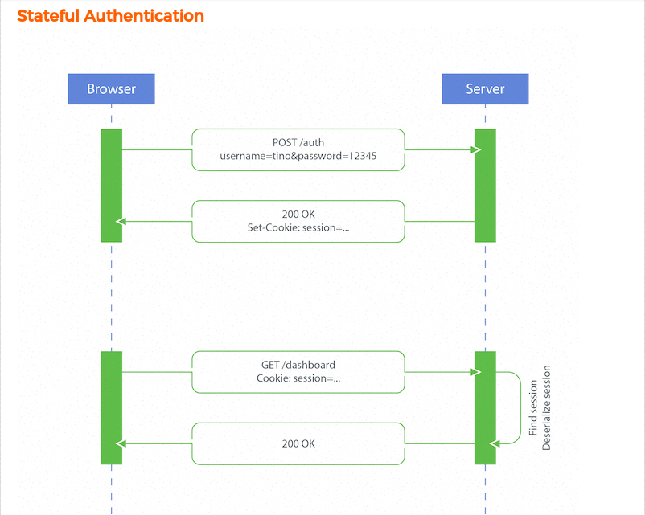
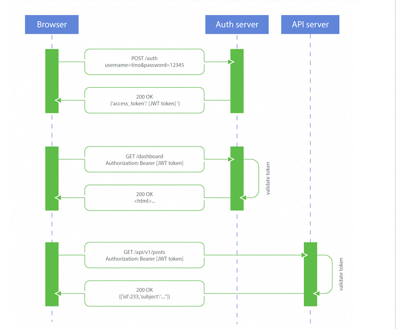

# Stateless vs stateful authentication

## Statefull Authentication

## Stateless Authentication

Pros:
* The biggest one is that your storage needs are zero, because you are not storing anything.
* An application that forgets about its access token will simply no longer remember it and the data will automatically expire.
* Systems can be entirely decoupled from each other, thanks to no more shared token storage.
 
